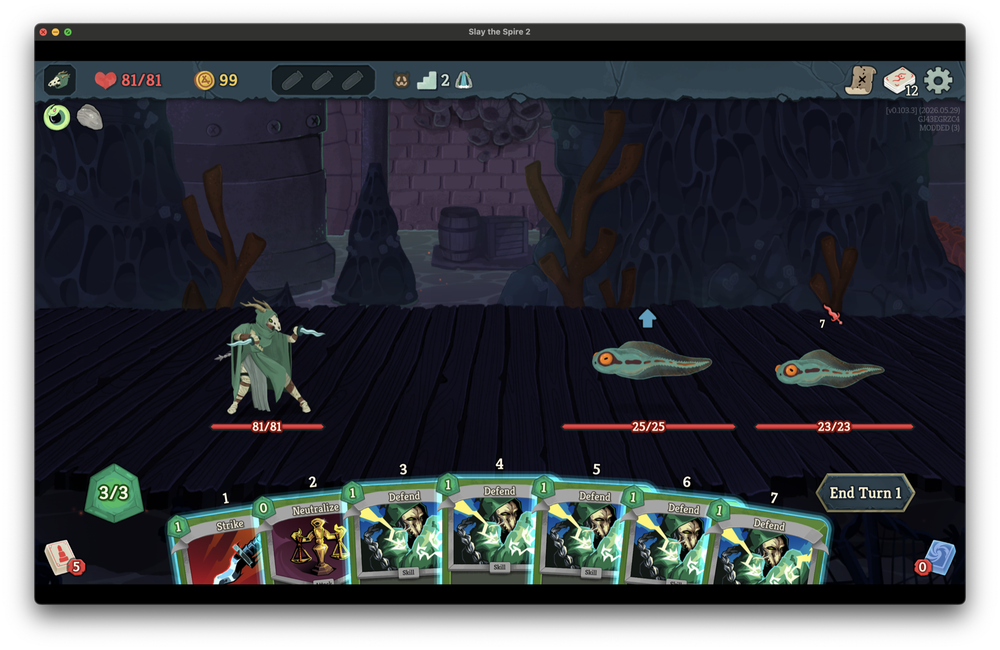
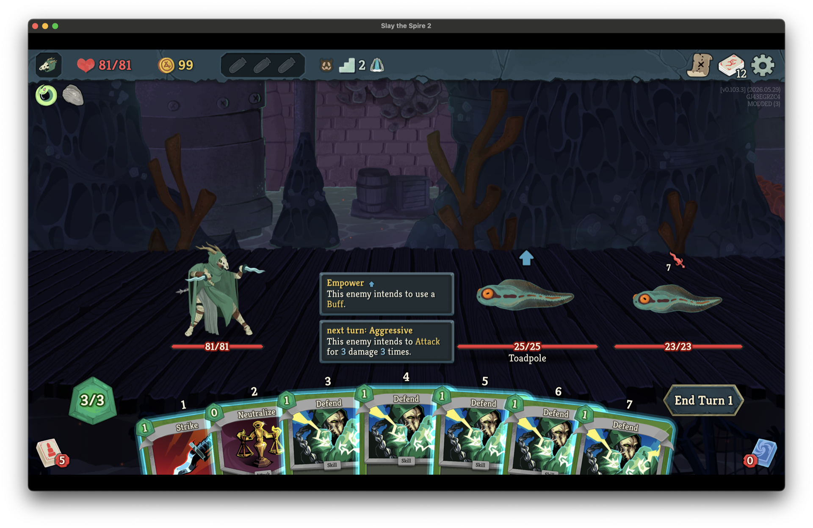
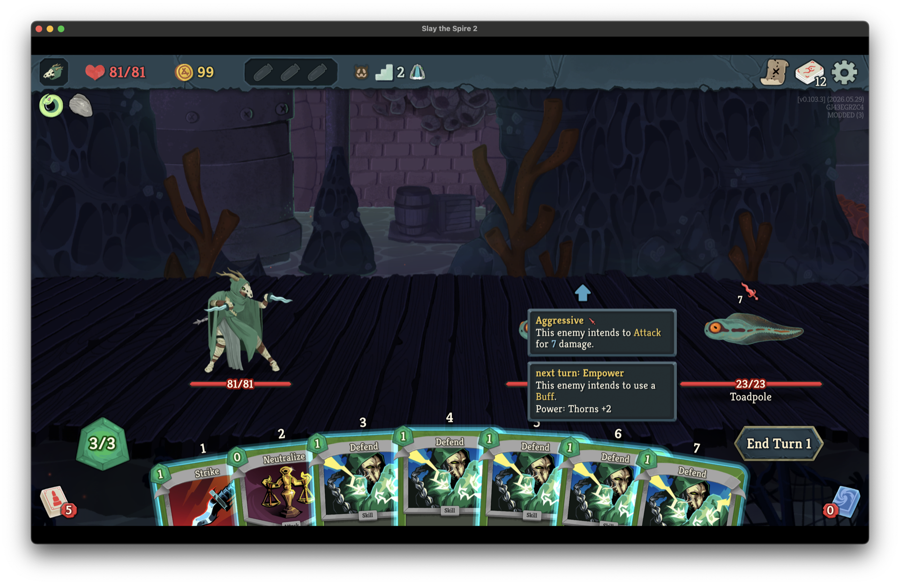

# Enemy Intent Tracker

Hover any enemy to see a prediction of what they will do on their next turn.

## What it does

Slay the Spire 2 shows you what an enemy will do *this* turn. **Enemy Intent Tracker** extends the existing hover tooltip with a forecast of the enemy's **next** turn, simulated through the same move-script the game itself runs.

Hover an enemy's intent icon, sprite, or health bar — the standard tooltip pops up, and a new section appears underneath labelled *"next turn: …"*.

### Predicted damage that actually reflects your state

The damage number isn't the raw card value. The forecast walks the multiplicative pipeline the engine uses when the attack actually fires, so it stays accurate when buffs and debuffs are in play:

- **Strength changes** the enemy will gain before its next move (e.g. Territorial)
- **Vigor** consumed by this turn's attack and re-gained for next turn
- **Vulnerable** decay (the +50% expires before the predicted hit if the debuff would tick off)
- **Intangible** — predicted damage clamps to **1** when the player will still have it during the enemy's next move (and respects Vulnerable-style decay rules for the buff itself)

### Power, debuff, and status intents

The forecast also enriches non-attack intents:

- **Buff intents** show the power name and amount the enemy will apply to itself, e.g. *"Power: Strength +2"*.
- **Debuff intents** show the debuff name and stack count, e.g. *"Debuff: Weak ×2"*.
- **Status intents** show the card name and count, e.g. *"Status: Wound ×3"*.

### Probabilistic moves

When an enemy's next move depends on a roll (e.g. the Crustacean's branching pattern), each candidate move is listed with its probability, so you can plan for the worst case.

## Screenshots

| Combat overview | Predicted next-turn attack | Predicted next-turn buff |
| --- | --- | --- |
|  |  |  |

## Installation

1. Make sure your game is updated to a version that supports native mods (the `mods/` folder exists under the game install).
2. Download the latest `EnemyIntentTracker-x.y.z.zip` from the Files tab.
3. Extract it. You'll get an `EnemyIntentTracker/` folder containing:
   - `EnemyIntentTracker.dll`
   - `EnemyIntentTracker.json`
   - `mod_manifest.json`
   - `Sts2Mods.Common.dll` (shared helper library, bundled with every release)
4. Drop the entire `EnemyIntentTracker/` folder into the game's `mods/` directory.
   - **Windows:** `…\Steam\steamapps\common\Slay the Spire 2\mods\`
   - **macOS:** `…/Steam/steamapps/common/Slay the Spire 2/SlayTheSpire2.app/Contents/MacOS/mods/`
   - **Linux (Proton):** `…/steamapps/common/Slay the Spire 2/mods/`
5. Launch the game. The mod activates automatically — no in-game toggle needed.

To uninstall, delete the `EnemyIntentTracker/` folder from `mods/`.

## Compatibility

- Single-player runs only. Multiplayer (co-op) is untested.
- Works alongside other intent / UI mods that read or extend the same `NIntent` / `NCreatureStateDisplay` hover surfaces (the patches are additive — they append a tip, they don't replace the existing one).
- Bundles its own copy of `Sts2Mods.Common.dll`. If another mod from the same author ships an older copy of that DLL in its own folder, both can coexist — each mod loads the copy from its own folder.

## Known limitations

- Predictions reflect what the enemy *intends* to do based on its current move-state. Effects that re-roll the move on turn end (rare) can cause the actual move to differ from the prediction.
- Damage prediction covers the standard Strength / Vigor / Vulnerable / Intangible pipeline. More exotic per-enemy multipliers (e.g. Frail on the enemy when it attacks) may not be modelled — please report any cases that look off.
- The prediction is reset on un-hover; it does not persist a fixed forecast across a turn boundary.

## Credits

- **Author:** killermelga
- Built on the work of the Slay the Spire 2 modding community — thanks to everyone who reverse-engineered the move state machine and shared their findings.
- Uses [HarmonyX](https://github.com/BepInEx/HarmonyX) for runtime patching.

## License

MIT — do whatever you like with it, attribution appreciated but not required.
